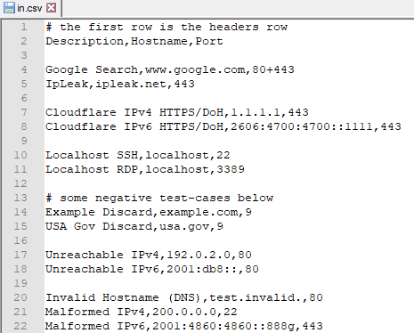
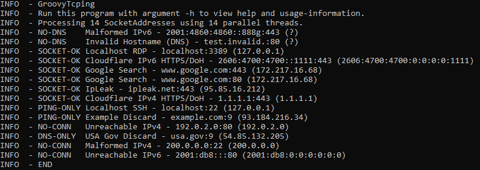
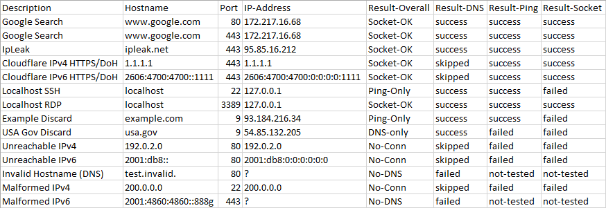

# GroovyTcping
A small Groovy Script for checking the network connectivitiy to a list of hosts+ports.

## Features and Usage
Assume your computer should be able (or not) to communicate with several other computers on the network.
With GroovyTcping, you can check the network-connectivity between your computer and a list of others like this:
1. Create a CSV file (in.csv), which contains the hostnames and ports you want to check, along with a description of each host.
2. Run GroovyTcping using: `groovy GroovyTcping.groovy`
3. GroovyTcping checks the connectivity to all hosts - and writes the results to an output CSV (out.csv).

*Remarks:*
1. GroovsTcping provides differentiated feedback, e.g. whether a TCP-socket could be established, whether the DNS-resolution worked and whether the target-host could be pinged.
2. The input and output CSVs can be edited and viewed in a text-editor or a spreadsheet application (like Excel).
3. GroovsTcping supports DNS-hostnames, IPv4 and IPv6 addresses. 
4. GroovyTcping has several optional command-line parameters. You can view them using the -h parameter. There's also a debug-mode (-d).
5. You can add further columns to the input-CSV - or conveniently perform a rescan by feeding GroovsTcping's earlier output back in again as the input.
6. GroovyCover is multi-threaded and scales with the host's core-count.
7. The source-code is really small at less than 250 LLOC.

## Screenshots
Sample input-CSV:

Sample console-output:

Sample output-CSV:

## Prerequisites
GroovyCover uses [Groovy](http://groovy-lang.org).

It doesn't matter how you install it, but some suggestions are:
* Windows: Get [Scoop](https://scoop.sh) and run "scoop install groovy" - or get [Chocolatey](https://chocolatey.org) and run "choco install groovy". 
* Ubuntu:  Run "sudo apt-get install groovy".

## Authors & Affiliations
* **Lukas Kästner** - *Initial work* - [lkaestner.com](https://lkaestner.com)
* no affiliations to Groovy

## License
This project is licensed under the MIT License. See the [LICENSE.md](LICENSE.md) file for details.

